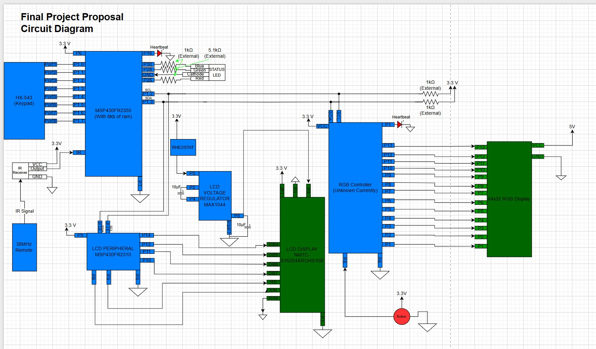
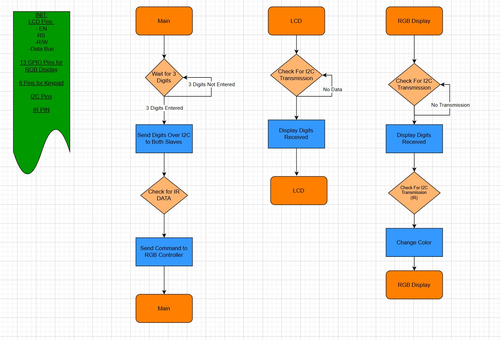

# Final project proposal

- [x] I have reviewed the project guidelines.
- [x] I will be working alone on this project.
- [x] No significant portion of this project will be (or has been) used in other course work.

## Embedded System Description

In this final project, I will be designing a digital dial board
which will be displayed on an 64x32 RGB screen.  The dial board can be set to an ET using the 4x4 keypad and the color can be changed using the IR remote.  The LCD screen will be used to display the selected dial in which would be seen within the car.

RGB Screen: The RGB screen will display decimal values from 0-9 such as 7.90 or 6.69.  Information for what number is to be be displayed will be sent over I2C from the main controller to the slave controlling the display.

LCD Screen:  The LCD screen will be used to show the driver of the car the dial currently displayed on the RBG board.  A 2310 will receive data over I2C and display the current dial in.

RGB LED:  This LED will flash green to indicate that a successful IR signal was received to alert the user to successful transmission.

IR Receiver/Remote: The color of the screen can be changed corresponding to an input from an IR remote.  Each number on the IR remote will correspond to a certain color that will be defined and known to the user. 

Push Button:  A push button will be wired to the controller to manually clear the output on the RGB screen from outside the car and will simply connect to the an I/O pin.

## Hardware Setup

Hardware Required:
- 64x32 6mm pitch RGB display
- 1838B IR receiver and Controller (38MHz)
- LCD Screen
- Voltage Inverter for contrast
- Potentiometer for adjust contrast
- MSP4302310
- MSP4302355
- RGB controll module (Unknown at this time)
- Push button
- RGB status LED for IR
- Status LED for 2310 and 2355 

As seen in the circuit diagram above, the MSP432355 is the master controller with the scheme with a MSP4302310 and the unknown RGB controller as slaves. Input from the keypad and IR remote can be processed and sent over I2C to the respective slaves to execute commands.
## Software overview

In my code, the system will power on and the LCD will request that a dial in to be entered.  When the user enters the three digit number, the controller will send an I2C transaction to both slaves.  When the slaves receive the data they will execute instructions accordingly.  When the IR remote is used, the master will receive the signal, and send an I2C transaction to the RGB controller to change the color of the display.  Lastly, the push button for the display will be placed on an interrupt and when pressed will clear the screen.

## Testing Procedure

Testing this project will be fairly straight forward and all the components can be demoed while attached to the breadboard.  In the future, this is something that I want to pursue further as a potential personal project or business opportunity and would like to try and package the system into a compact unit.  If everything were to go well with the development I would be willing to begin this process to make the system as a whole a clean and compact unit.

## Prescaler

Desired Prescaler level: 

- [ ] 100%
- [x] 95% 
- [ ] 90% 
- [ ] 85% 
- [ ] 80% 
- [ ] 75% 

### Prescalar requirements 

**Outline how you meet the requirements for your desired prescalar level**

**The inputs to the system will be:**
1.  IR Receiver: Receives signals from the 38MHz remote which will be decoded and assigned to a keypress used for commands
2.  4x4 Keypad: Will be used by the user to set the digits displayed on the LCD and RGB board.  Data transmitted over I2C
3. Button: Button will be used to commit a manual clear of the RGB screen.

**The outputs of the system will be:**
1.   64x32 RGB Display : Has not been used before in previous projects and, is itself new hardware, and uses shift registers which have not been previously covered 
2. LCD Screen: Used in previous projects but will provide good reference to the user in the actual application so that the displayed dial in is known.
3.  RGB Status LED: Used in previous projects, that will alert the user if a valid IR transaction has been received.
4. Red Status LED: Indicate proper function of peripheral microcontrollers

**The project objective is**

{The Project objective is to create a digital RGB dial board that can be controlled form an in car keypad.  The color of the keypad can be controlled by an IR remote with each key corresponding to a different color}

**The new hardware or software modules are:**
1. RGB Dispaly: The RGB display is 64x32 display that can be interfaced to display an array of fully customizable images, and characters.  The display utilizes shift registers which work to put information provided over the whole display. (Information is taken in, latched, and moved over and new data is called in)
2. IR Remote and Receiver: The IR receiver is tuned to receive 38MHz signals from a remote and send a series of pulses referred to as NEC procedure.  Within this transaction, an address of the remote is sent along with and 8 bit command corresponding to to a key press.
3. Off Board Button:  An offboard button is fairly simple and straight forward but will require some thought in the matter of debouncing to stop multiple readings from a single press.
4. RGB Controller: This microcontroller has not been currently chosen but will likely be a new model not previously used.  It will have enough processing power and ram to interface with the RGB display.

The Master will be responsible for:

{The master will be responsible for sending I2C commands to the LCD and RGB slaves along with processing keypad entries and decoding IR inputs}

The Slave(s) will be responsible for:

{The RGB display and LCD slaves will be used to drive patterns and numbers dislayed on their respective screens}

### Argument for Desired Prescaler

It is my belief that this project is worthy of a 95% prescalar.  The project has 3 inputs being the IR receiver, 4x4 keypad and the reset button used for the RGB display.  It also includes three outputs which include the LCD screen, the RGB display, and the IR transmission status RGB.  This project uses three pieces of hardware that have not been used in previous projects in the IR receiver and remote, RGB display, and the push button.  The button itself it incredibly simple so does not contribute much but the IR receiver and RGB screen really bring in the cool factor to the project.  Looking into the RGB display, the system uses shift registers which will be something new and may be complex that will take some time to interface with and understand.  Futhermore, the display contains 2048 LEDS which can each be individually controlled.  Unlike a seven segment display which can be set by using a single command, this will recquire some more finesse to obtain my desired results.  Additionally, decoding the IR signals will require some time to determine the address of the remote and find the command corresponding to each keypress and assigning that command to to a color value that can be easily sent over I2C to the RGB controller.  With this considered, I believe that the project meets the qualifications for the 95% prescalar and is a project that has real objective relative to my own hobbies.

